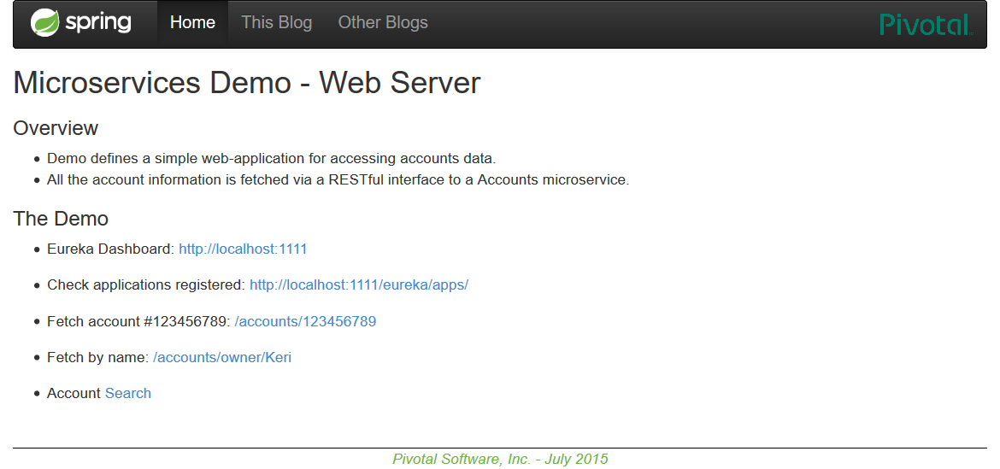
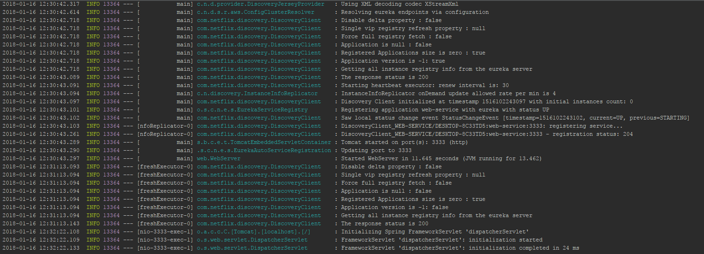
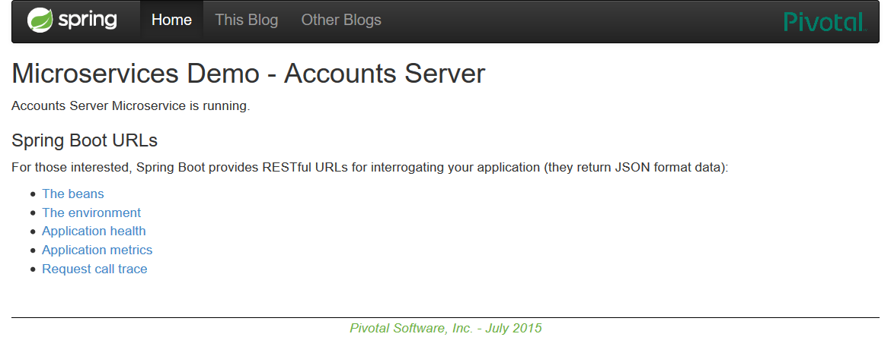
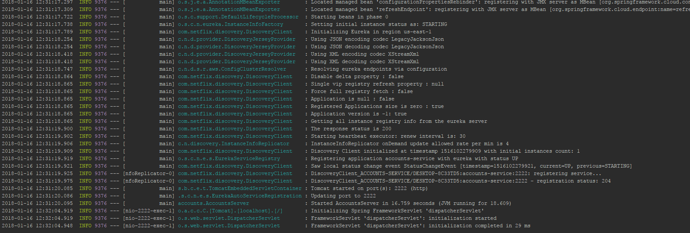
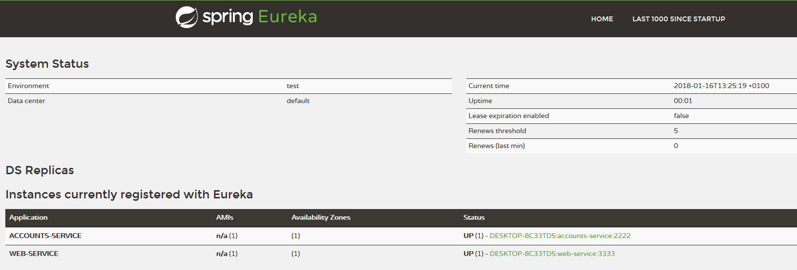
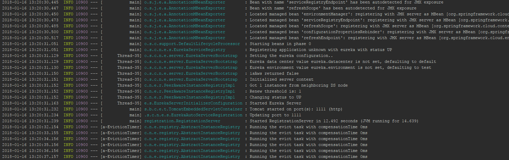
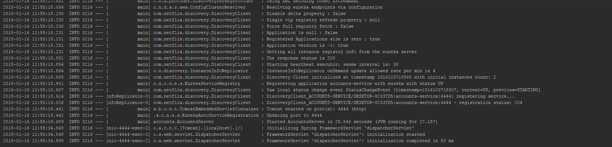
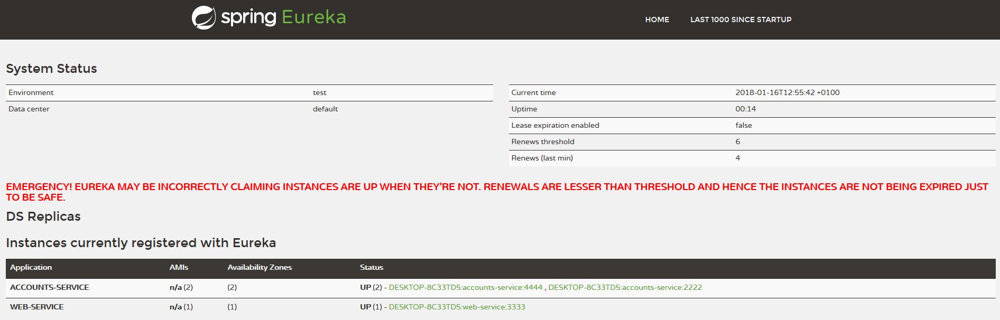

**1. The two microservices are running and registered**

Screenshots of the functioning of the Web Server and Accounts Server services, respectively.

Web Server

Accounts Server

**2. The service registration service has the two microservices registered.**

Screenshots of the Registry service with the two registered services.

**3. A second account microservice is running in the port 4444 and it is registered.**

Screenshots of the second Account service.

**4. A brief report describing what happens when you kill the microservice with port 2222.** 

***Can the web service provide information about the accounts? Why?***

The registration service allows the web service to know that there are two possible accounts services. 
In the event that one of them fails, the web service will ask the registry that another service is available, 
allowing to continue working.
